深度学习领域，最常见的就是各种网络模型，那么在写论文或者文章，介绍网络模型的时候，最好的办法当然就是展示代码画图，给大家分享23个设计和可视化网络结构的工具，希望对大家有所帮助。

### 1. draw\_convnet

Github: [https://github.com/gwding/draw\_convnet](https://link.zhihu.com/?target=https%3A//github.com/gwding/draw_convnet)

star 数量：1.7k+

这个工具最后一次更新是2018年的时候，一个Python脚本来绘制卷积神经网络的工具，效果如下所示：

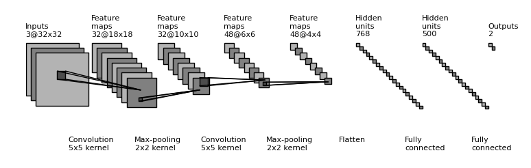

### 2. NNSVG

网址：https://alexlenail.me/NN-SVG/LeNet.html

这个工具有 3 种网络结构风格，分别如下所示：

LeNet 类型：

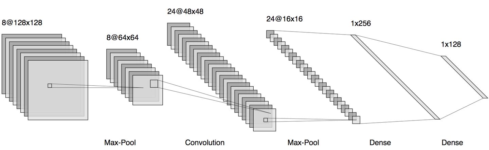

AlexNet 类型：

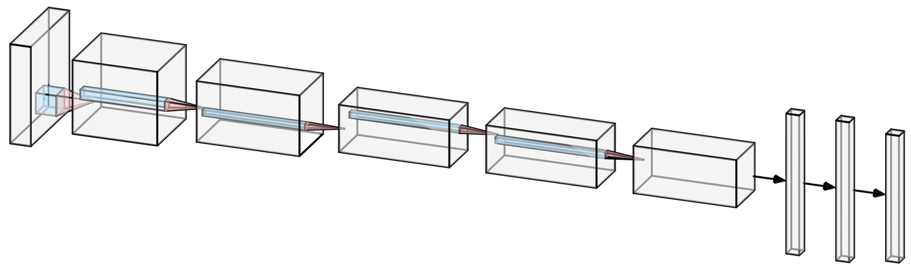

FCNN 类型：

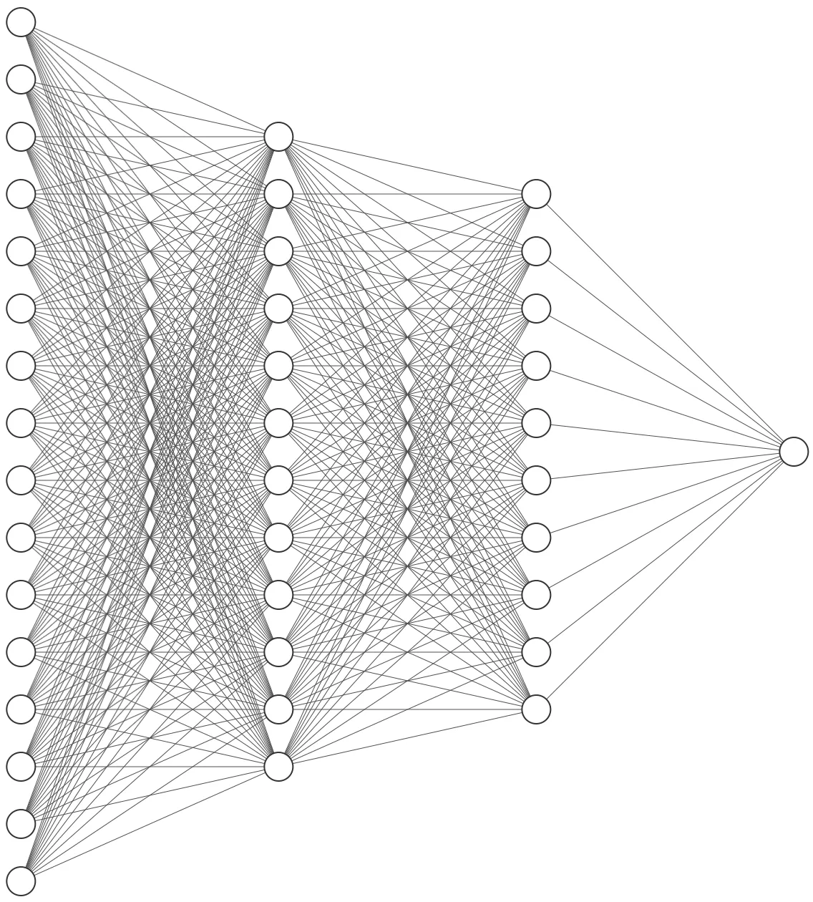

### 3. PlotNeuralNet

GitHub 地址：[https://github.com/HarisIqbal88/PlotNeuralNet](https://link.zhihu.com/?target=https%3A//github.com/HarisIqbal88/PlotNeuralNet)

star 数量：8.2k+

这个工具是基于 Latex 代码实现的用于绘制网络结构，可以看看使用例子看看这些网络结构图是如何绘制出来的。

效果如下所示：

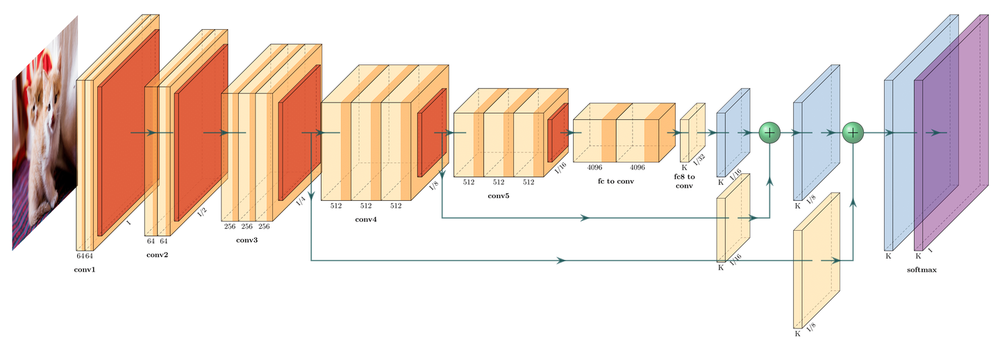

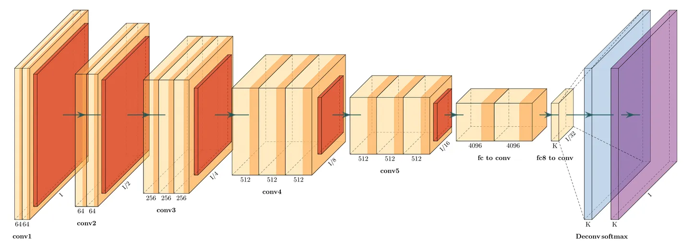

##### 安装

这里给出在 Ubuntu 和 windows 两个系统的安装方式：

ubuntu 16.04

Ubuntu 18.04.2 是基于这个网站：[https://gist.github.com/rain1024/98dd5e2c6c8c28f9ea9d](https://link.zhihu.com/?target=https%3A//gist.github.com/rain1024/98dd5e2c6c8c28f9ea9d)，安装命令如下：

##### Windows

1. 首先下载并安装 MikTex，下载网站：https://miktex.org/download

2. 其次，下载并安装 windows 的 bash 运行器，推荐这两个：

* Git：https://git-scm.com/download/win

* Cygwin：https://www.cygwin.com/

##### 使用例子

安装完后就是使用，按照如下所示即可：

##### Python 的用法如下

1. 先创建新的文件夹，并生成一个新的 python 代码文件：

2. 然后在新的代码文件 `my_arch.py` 中添加这段代码，用于定义你的网络结构，主要是不同类型网络层的参数，包括输入输出数量、卷积核数量等

import sys
sys.path.append('../')
from pycore.tikzeng import \*
defined your arch
arch = \[
&#x20;   to\_head( '..' ),
&#x20;   to\_cor(),
&#x20;   to\_begin(),
&#x20;   to\_Conv("conv1", 512, 64, offset="(0,0,0)", to="(0,0,0)", height=64, depth=64, width=2 ),
&#x20;   to\_Pool("pool1", offset="(0,0,0)", to="(conv1-east)"),
&#x20;   to\_Conv("conv2", 128, 64, offset="(1,0,0)", to="(pool1-east)", height=32, depth=32, width=2 ),
&#x20;   to\_connection( "pool1", "conv2"),
&#x20;   to\_Pool("pool2", offset="(0,0,0)", to="(conv2-east)", height=28, depth=28, width=1),
&#x20;   to\_SoftMax("soft1", 10 ,"(3,0,0)", "(pool1-east)", caption="SOFT"  ),
&#x20;   to\_connection("pool2", "soft1"),
&#x20;   to\_end()
&#x20;   ]
def main():
&#x20;   namefile = str(sys.argv\[0]).split('.')\[0]
&#x20;   to\_generate(arch, namefile + '.tex' )
if&#x20;
name
&#x20;\== '
\_\_main\_\_
':
&#x20;   main()

* 最后，运行脚本

### 4. TensorBoard

https://www.tensorflow.org/tensorboard/graphs?hl=zh-cn

使用过 TensorFlow 的都应该知道这个绘图工具，TensorFlow 的可视化工具，查看网络结构、损失的变化、准确率等指标的变化情况等。

网络结构的效果如下图所示：

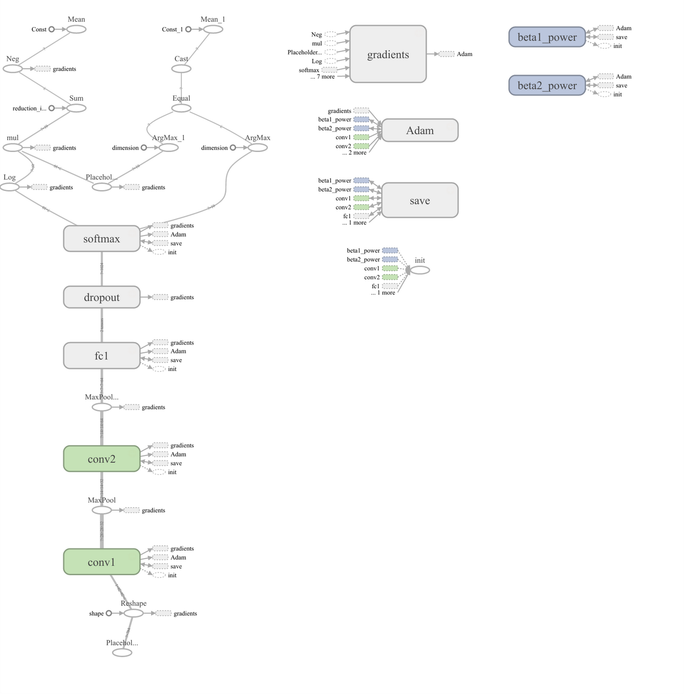

### 5. Caffe

[https://github.com/BVLC/caffe/blob/master/python/caffe/draw.py](https://link.zhihu.com/?target=https%3A//github.com/BVLC/caffe/blob/master/python/caffe/draw.py)

Caffe 的绘图工具，效果如下所示：

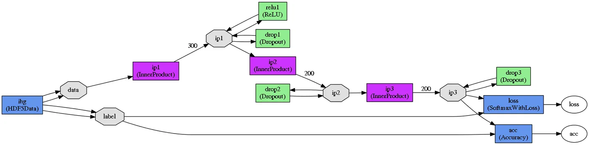

### 6. Matlab

https://www.mathworks.com/help/deeplearning/ref/view.html

Matlab 的绘图工具，效果如下所示：

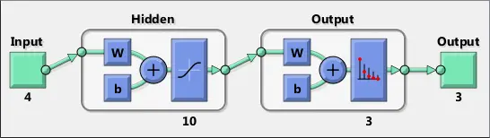

### 7. Keras.js

https://transcranial.github.io/keras-js/#/inception-v3

Keras 的可视化工具，效果如下所示：

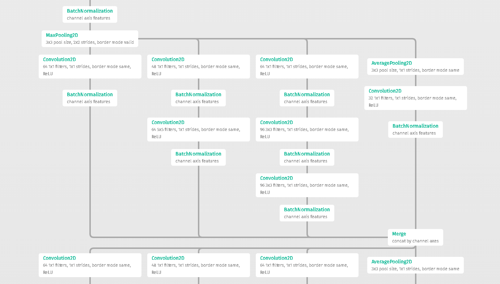

### 8. keras-sequential-ascii

[https://github.com/stared/keras-sequential-ascii/](https://link.zhihu.com/?target=https%3A//github.com/stared/keras-sequential-ascii/)

Keras 的一个第三方库，用于对序列模型的网络结构和参数进行检查，直接打印出来结果，比如，VGG 16 的网络结构如下所示，每层网络的参数维度，参数的数量以及占整个网络参数的比例都会展示出来：

Keras 的一个第三方库，用于对序列模型的网络结构和参数进行检查，直接打印出来结果，比如，VGG 16 的网络结构如下所示，每层网络的参数维度，参数的数量以及占整个网络参数的比例都会展示出来：

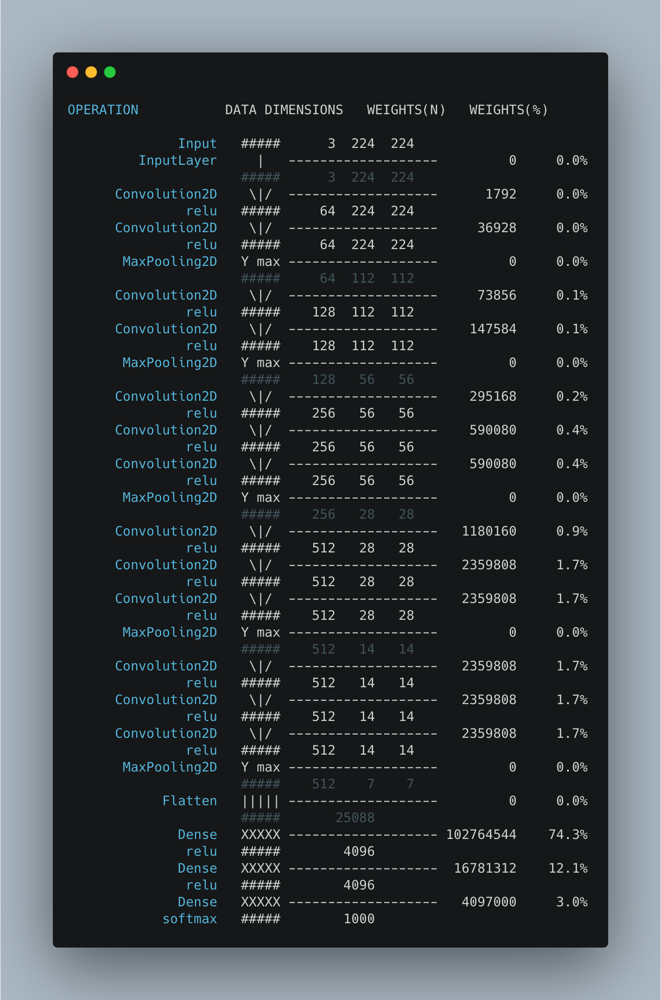

##### 安装

通过 PyPI：

直接通过 github 仓库：

##### 使用例子

在代码中添加：

### 9. Netron

[https://github.com/lutzroeder/Netron](https://link.zhihu.com/?target=https%3A//github.com/lutzroeder/Netron)

Star 数量：9.7k+

##### 简介

Netron 可以可视化神经网络，深度学习和机器学习模型，目前支持的网络框架包括：

* ONNX: `.onnx, .pb, .pbtxt` 文件

* Keras：`.h5，.keras` 文件

* Core ML：`.mlmodel`

* Caffe：`.caffemodel, .prototxt`

* Caffe2：`predict_net.pb, predict_net.pbtxt`

* Darknet: `.cfg`

* MXNet：`.model, -symbol.json`

* ncnn：`.param`

* TensorFlow Lite：`.tflite`

另外，Netron 也有实验支持这些框架:

* TorchScript: `.pt, .pth`

* PyTorch：`.pt, .pth`

* Torch: `.t7`

* Arm NN：`.armnn`

* Barracuda：`.nn`

* BigDL`.bigdl`, `.model`

* Chainer ：`.npz`, `.h5`

* CNTK ：`.model`, `.cntk`

* Deeplearning4j：`.zip`

* MediaPipe：`.pbtxt`

* [http://ML.NET](https://link.zhihu.com/?target=http%3A//ML.NET)：`.zip`

* MNN：`.mnn`

* OpenVINO ：`.xml`

* PaddlePaddle ：`.zip`, `model`

* scikit-learn ：`.pkl`

* Tengine ：`.tmfile`

* TensorFlow.js ：`model.json`, `.pb`

* TensorFlow ：`.pb`, `.meta`, `.pbtxt`, `.ckpt`, `.index`

其效果如下所示：

##### 安装

安装方式，根据不同系统，有所不一样：

macOS

两种方式，任选一种：

1. 下载 `.dmg` 文件，地址：[https://github.com/lutzroeder/netron/releases/latest](https://link.zhihu.com/?target=https%3A//github.com/lutzroeder/netron/releases/latest)

2. 运行命令 `brew cask install netron`

Linux

也是两种方式，任选其中一种：

1. 下载 `.AppImage` 文件，下载地址：[https://github.com/lutzroeder/netron/releases/latest](https://link.zhihu.com/?target=https%3A//github.com/lutzroeder/netron/releases/latest)

2. 运行命令 `snap install netron`

Windows

也是两种方式，任选其中一种：

1. 下载 `.exe` 文件，下载地址：[https://github.com/lutzroeder/netron/releases/latest](https://link.zhihu.com/?target=https%3A//github.com/lutzroeder/netron/releases/latest)

2. 运行命令 `winget install netron`

浏览器：浏览器运行地址：https://www.lutzroeder.com/projects/

Python 服务器：

首先，运行安装命令 `pip install netron`，然后使用方法有两种：

* 命令行，运行 `netron [文件路径]`

* `.py` 代码中加入

### 10. DotNet

[https://github.com/martisak/dotnets](https://link.zhihu.com/?target=https%3A//github.com/martisak/dotnets)

这个工具是一个简单的 python 脚本，利用 `Graphviz` 生成神经网络的图片。主要参考了文章：https://tgmstat.wordpress.com/2013/06/12/draw-neural-network-diagrams-graphviz/

用法如下：

在 MaxOS 上：

或者生成 PDF 文件

其效果如下所示：

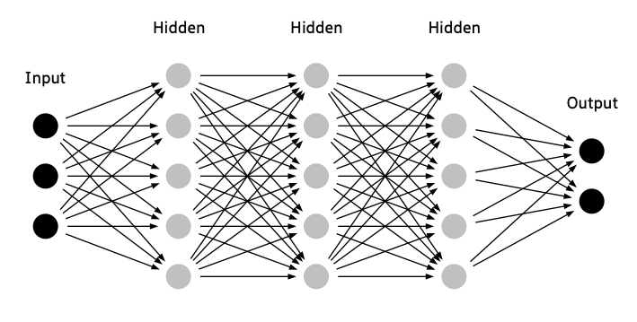

### 11. Graphviz

https://www.graphviz.org/

教程：https://tgmstat.wordpress.com/2013/06/12/draw-neural-network-diagrams-graphviz/

`Graphviz` 是一个开源的图可视化软件，它可以用抽象的图形和网络图来表示结构化信息。

其效果如下所示：

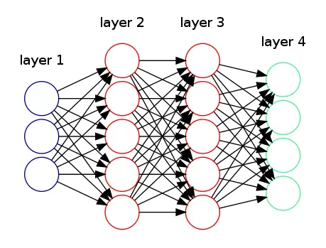

### 12. Keras Visualization

https://keras.io/api/utils/model\_plotting\_utils/

这是 Keras 库中的一个功能模块-- `keras.utils.vis_utils` 提供的绘制 Keras 网络模型（使用的是 `graphviz` ）

其效果如下所示：

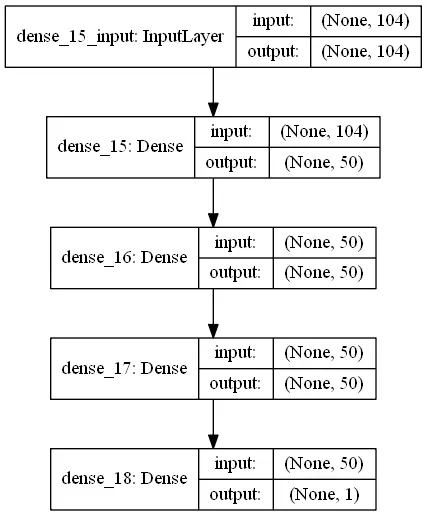

### 13. Conx

https://conx.readthedocs.io/en/latest/index.html

Python 的一个第三方库 `conx` 可以通过函数`net.picture()` 来实现对带有激活函数网络的可视化，可以输出图片格式包括 SVG, PNG 或者是 PIL。

其效果如下所示：

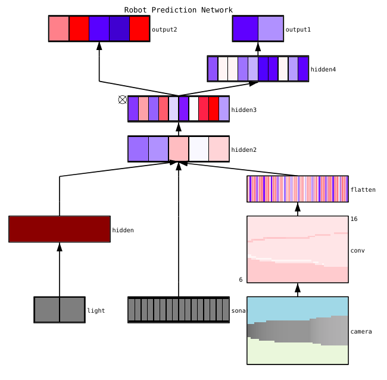

### 14. ENNUI

https://math.mit.edu/ennui/

通过拖和拽相应的图形框来实现一个网络结构的可视化，下面是一个可视化 LeNet 的例子：

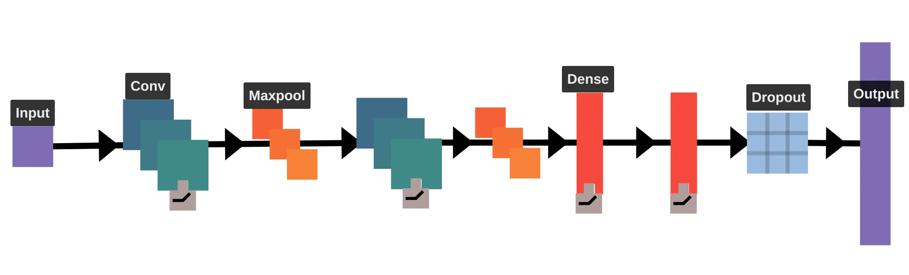

### 15. NNet

教程：https://beckmw.wordpress.com/2013/03/04/visualizing-neural-networks-from-the-nnet-package/

R 工具包，简单的使用例子如下：

效果如下所示：

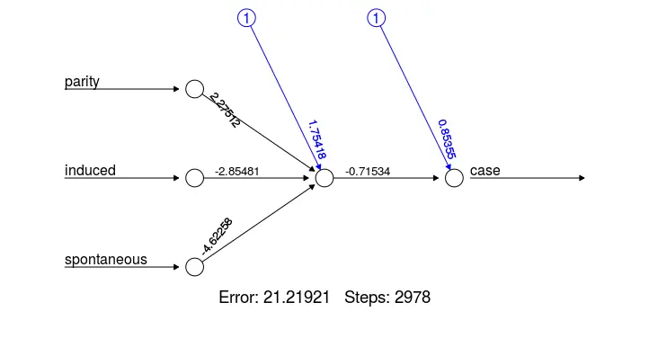

### 16. GraphCore

https://www.graphcore.ai/posts/what-does-machine-learning-look-like

GraphCore 主要是展示神经网络中操作的可视化结果，但也包括了网络结构的内容，比如每层的网络参数等。

下面展示了两个网络结构的可视化效果--AlexNet 和 ResNet50.

AlexNet

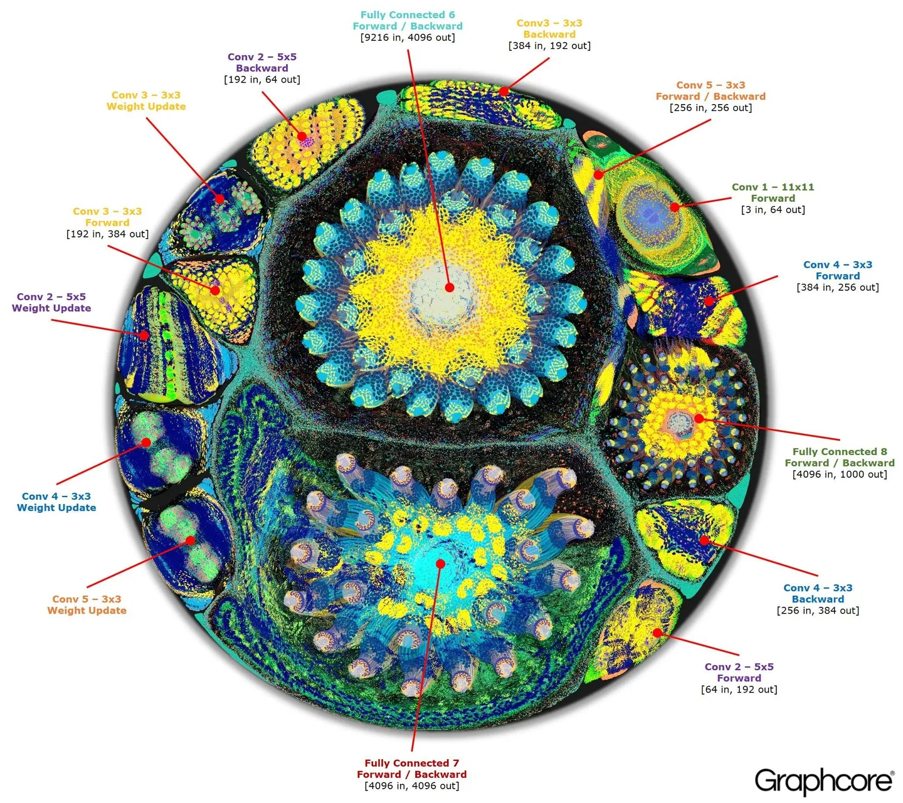

ResNet50

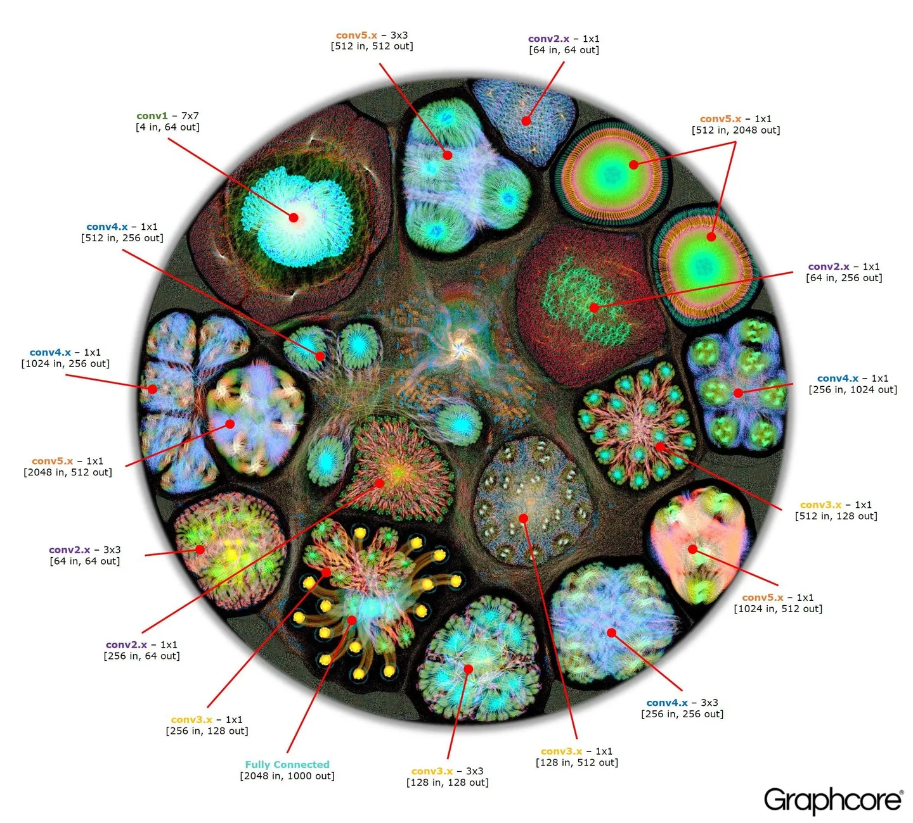

### 17. Neataptic

https://wagenaartje.github.io/neataptic/

Neataptic 提供了非常灵活的神经网络可视化形式

* 神经元和突触可以通过一行代码进行删除；

* 没有规定神经网络的结构必须包含哪些内容

这种灵活性允许通过神经进化（neuro-evolution）的方式为数据集调整网络结构的形状，并通过多线程来实现。

其效果如下图所示：

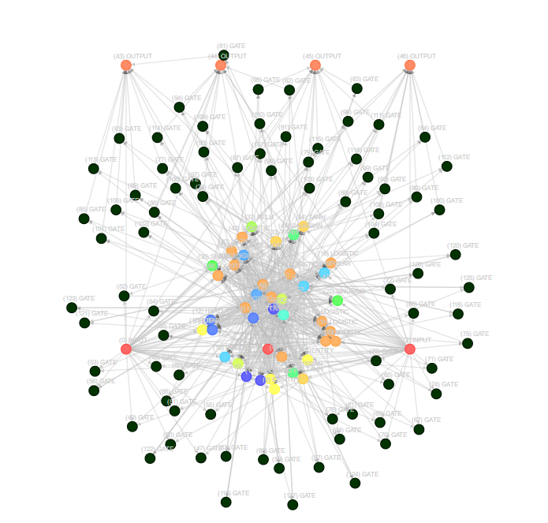

### 18. TensorSpace

https://tensorspace.org/

教程：https://www.freecodecamp.org/news/tensorspace-js-a-way-to-3d-visualize-neural-networks-in-browsers-2c0afd7648a8/

TensorSpace 是通过 TensorFlow.js，Three.js 和 Tween.js 构建的一个神经网络三维可视化框架。它提供了 APIs 来构建深度学习网络层，加载预训练模型以及在浏览器中就可以生成三维的可视化结构。通过应用它的 API 接口，可以更直观地可视化和理解通过 TensorFlow、Keras 和 TensorFlow.js 等构建的任何预训练模型。

效果如下图所示：

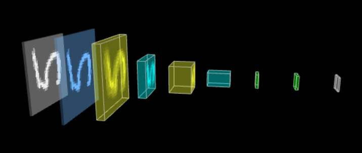

### 19. Netscope CNN Analyzer

https://dgschwend.github.io/netscope/quickstart.html

一款基于 web 端的可视化和分析卷积神经网络结构（或者是任意有向无环图），当前支持使用 Caffe 的 prototxt 形式。

效果如下图所示：

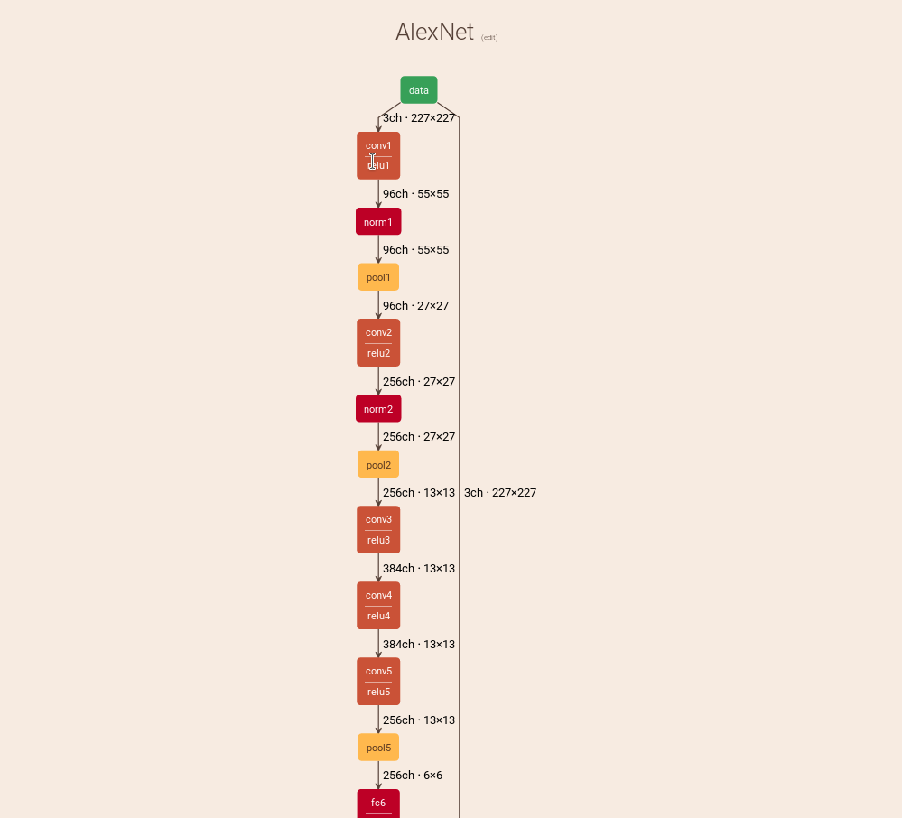

### 20. Monial

[https://github.com/mlajtos/moniel](https://link.zhihu.com/?target=https%3A//github.com/mlajtos/moniel)

计算图的交互式表示法，展示例子如下所示，左边是输入，右侧就是对应结构的可视化结果。

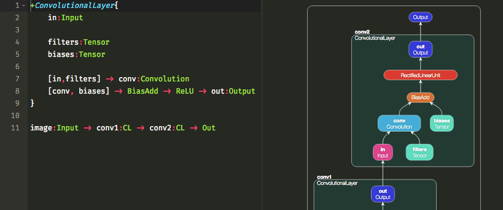

### 21. Texample

https://texample.net//tikz/examples/neural-network/

这个工具也可以通过 LaTex 来实现一个神经网络结构的可视化，比如，一个 LaTex 的例子：

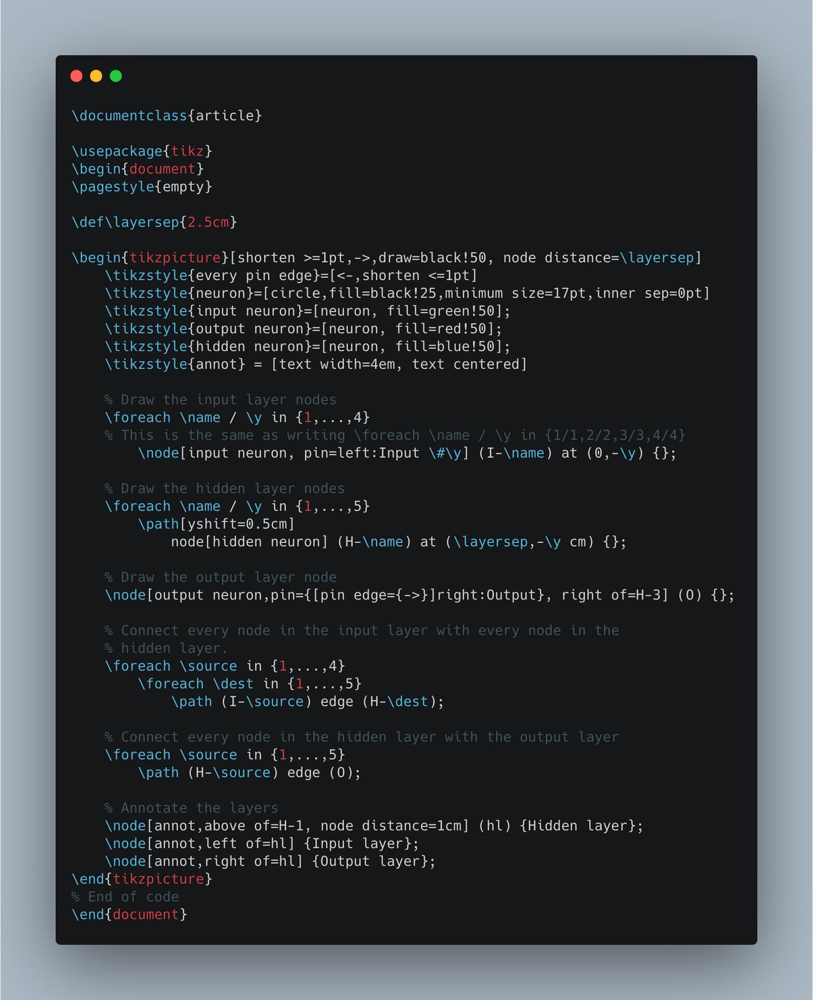

其可视化结果如下所示：

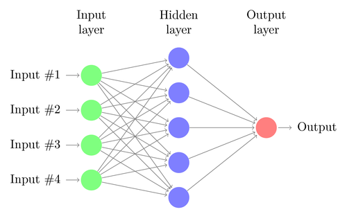

### 22. Quiver

github: [https://github.com/keplr-io/quiver](https://link.zhihu.com/?target=https%3A//github.com/keplr-io/quiver)

Star 数量：1.5k

Keras 的一款交互式可视化卷积特征的一个工具

展示例子如下所示：

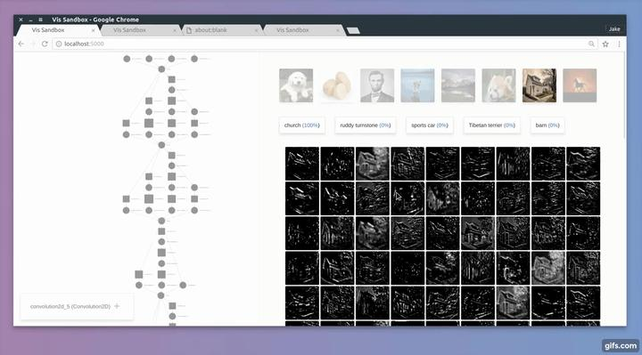

##### 安装方式

两种方式，直接用 `pip`

或者通过 GitHub 仓库的方式：

##### 使用例子

首先构建你的 keras 模型：

接着通过一行代码来发布可视化的展示板：

最后在刚刚设置的文件夹中就可以看到每个网络层的可视化结果。

如果是想在浏览器中查看，代码如下：

默认的地址是 `localhost:5000`

### 23. Net2Vis

论文地址：https://arxiv.org/abs/1902.04394

Github：[https://github.com/viscom-ulm/Net2Vis](https://link.zhihu.com/?target=https%3A//github.com/viscom-ulm/Net2Vis)

这款工具的效果例子图：

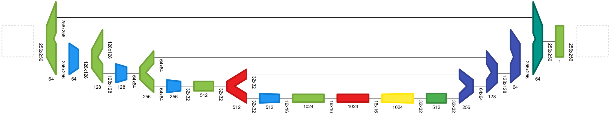

##### 安装方法

首先假设已经安装了 python3 和 npm，然后：

1. 克隆这个 github 项目：

2. 为了后端工作，这里需要安装 Docker 和 Cairo，主要的作用是转换为 PDF，以及在浏览器里可以运行模型。

如果是采用 docker，那么也要运行 daemon，这样才能在单独的容器里运行粘贴的代码。

对于后端的配置，步骤如下：

1.进入后端的文件夹内
cd backend
2\. 安装依赖包
pip3 install -r requirements.txt
3\. 安装 docker容器
docker build --force-rm -t tf\_plus\_keras .
4\. 根据你的系统安装对应的 python 的 cairo 包，比如Debian 的 python-cairosvg
5\. 开启服务
python server.py

而前端是一个 react 的应用，使用方式如下：

1\. 进入文件夹
cd net2vis
2\. 安装 JavaScript 的依赖包
npm install
3\. 开启应用
npm start

***

### 24. 总结

这23款工具的输出结果既有直接打印的，也有黑白图、彩色图、炫酷的球体可视化结果，以及三维可视化结果，基本都可以支持目前主流的深度学习框架，当然也有的是基于特定框架，比如keras，实现的对应第三方库。

可以根据需求和使用的框架来进行选择，相信应该能够满足大部分人对可视化网络结构的需求。
